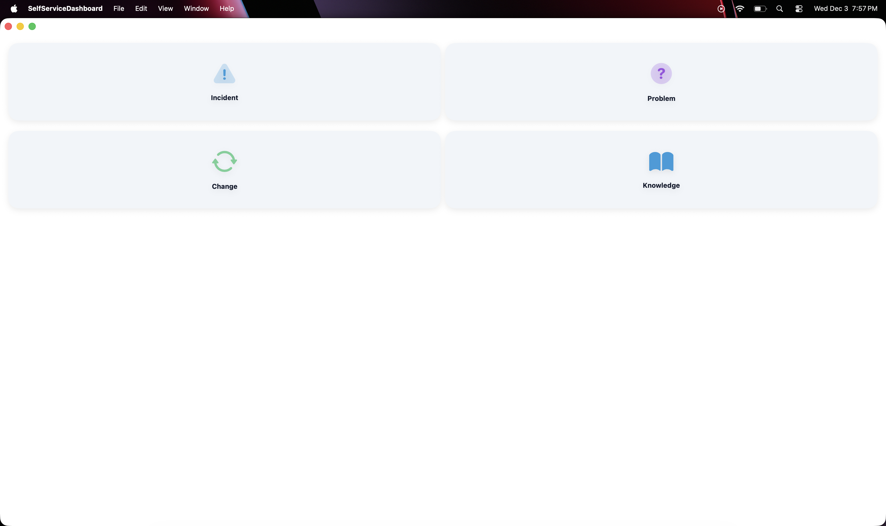
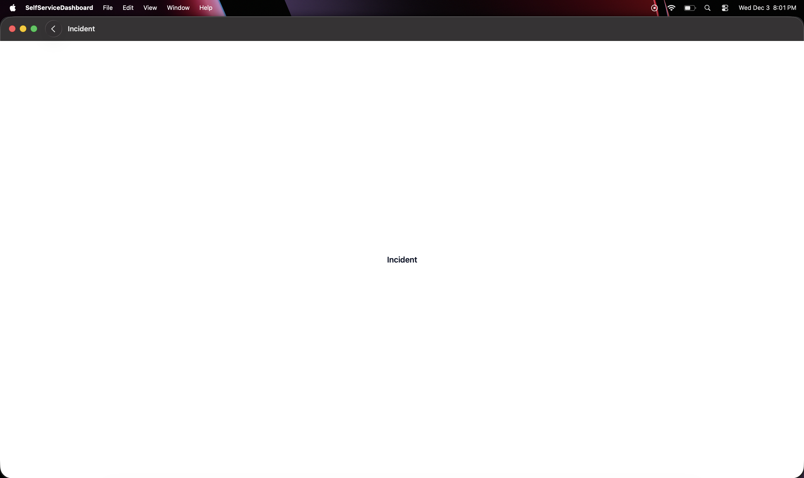
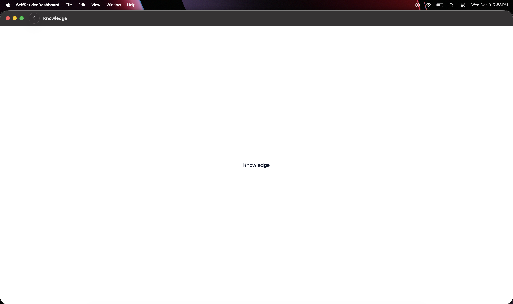

Each module is cleanly separated for readability and future scalability.

---

## 🛠️ Technologies Used

- **SwiftUI**
- **NavigationStack**
- **LazyVGrid**
- **Xcode 16+**
- **iOS 17 SDK**
- Custom color branding
- Component-driven architecture

---

## 🚀 Purpose

This project serves as:

- An iOS portfolio piece showcasing **UI/UX ability**, **component architecture**, and **enterprise-grade SwiftUI patterns**
- A reusable template for future service management dashboards
- A demonstration of clean code, modular design, and scalable structure

---

## 🧪 Future Enhancements

- 🔌 API Integration (ServiceNow / Azure)
- ⚙️ State-driven data loading
- 📊 Metrics & reporting tiles
- 📱 Wider device responsiveness testing
- 🎥 Animated product demo GIF

---

## 🖼️ Screenshots

Below are UI previews from the **Self Service Dashboard** module:

### 📊 Dashboard  

### ⚠️ Incident Workspace  

### 📘 Knowledge Workspace  

## 🧾 Contact

If you'd like to collaborate — or you're reviewing this for a dev role — feel free to reach out:

**JD Mulcahy**  
📧 Email: [mr.mulcahy@icloud.com](mailto:mr.mulcahy@icloud.com)  
🐙 GitHub: [mulcahy-git](https://github.com/mulcahy-git)  
🔗 LinkedIn: [https://www.linkedin.com/in/jdmulcahy/](https://www.linkedin.com/in/jdmulcahy/)

---
